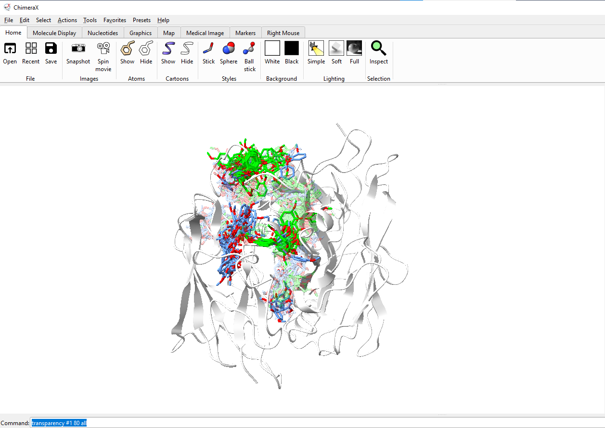
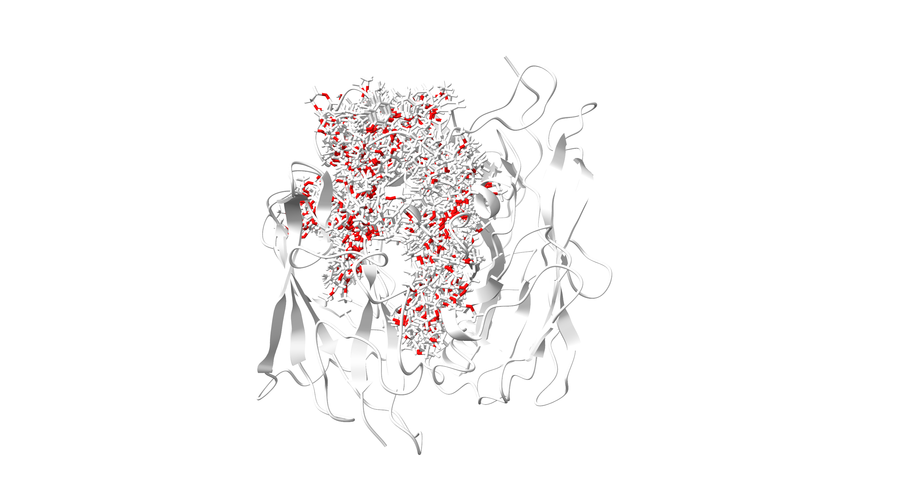
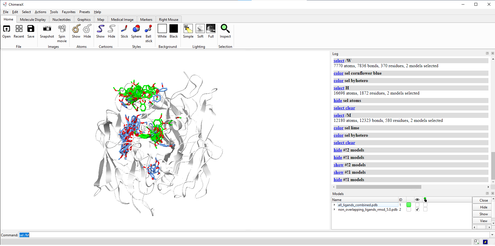
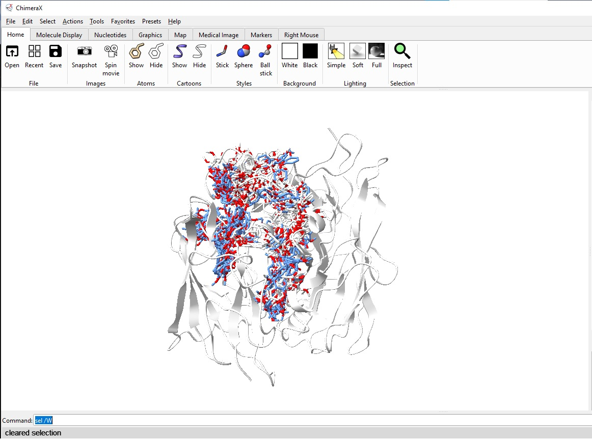
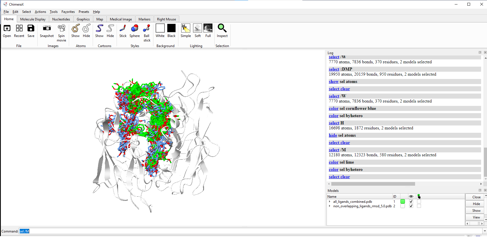

# Superposed Docking Analysis: WT vs Mutant

## Overview

You have 2 systems and  want to compare if a ligand binds in different places? 
This tool performs comparative analysis of docking results from Wild-Type (WT) and Mutant protein systems. It aligns all structures, identifies overlapping ligand poses based on RMSD criteria, and generates visualization-ready PDB files for structural comparison.

### Chimerax Visualization of 2 outputs: all ligands in transparent, UNIQUE  gandsfor WT in blue, UNIQUE ligands for mutant in green



## Features

- **Structure Alignment**: Superimposes all structures based on specified atoms (e.g., CU atoms)
- **Ligand Comparison**: Calculates RMSD between ligand poses from different systems
- **Overlap Filtering**: Removes redundant poses based on customizable RMSD threshold
- **Dual Output**: Generates both complete and filtered structure sets
- **Chain-based Visualization**: Uses distinct chain identifiers for easy visualization in molecular viewers

## Requirements

```python
mdtraj>=1.9.0
numpy>=1.20.0
glob
os
```

## Input Structure

The script expects PDB structures organized in the following directory structure:

```
/path/to/WT/
├── subfolder1/
│   └── structure1.pdb
├── subfolder2/
│   └── structure2.pdb
└── ...

/path/to/MUTANT/
├── subfolder1/
│   └── structure1.pdb
├── subfolder2/
│   └── structure2.pdb
└── ...
```
or modify yout path to a folder where pdbs structure are.

## Usage

### 1. Configure Paths

Update the path patterns in the script:

```python
wt_path_pattern = "/path/to/WT/*/*.pdb"
mut_path_pattern = "/path/to/MUTANT/*/*.pdb"
```

### 2. Run Analysis

The script performs the following steps:

1. **Load Structures**: Reads all PDB files from specified directories
2. **Structural Alignment**: Superimposes all structures on CU atoms (customizable)
3. **Generate Combined PDB**: Creates visualization file with all ligands of both systems. See images (all_ligands.png)
4. **Filter Overlaps**: Removes poses with RMSD < threshold. Note that you can modify the condition; if you need to know if ligands are in the same place for both systems just change RMSD > threshold. See images/non_overlapping.png
5. **Export Results**: Saves filtered structure set

### 3. Adjust Parameters

```python
# RMSD threshold for overlap detection (Angstroms)
rmsd_threshold = 3.0

# Ligand residue name
ligand_name = "DMP"

# Alignment atoms/residues
alignment_selection = "resname CU"
```

## Output Files

### 1. Complete Dataset: `all_ligands_combined_BE-5.5.pdb`

- Reference protein structure
- All WT ligands (Chain W)
- All Mutant ligands (Chain M)
- Suitable for initial visualization and comparison

### 2. Filtered Dataset: `non_overlapping_ligands_BE-5.5.pdb`

- Same reference protein structure
- Only non-overlapping ligands (RMSD > threshold)
- Maintains chain identifiers (W/M)
- Optimized for clear visualization of distinct binding modes

## Results Visualization

### Before filtering - All ligand poses


### After filtering - Non-overlapping poses only  


### Chain identification for visualization
- **Chain W (WT)**: Blue ligands


- **Chain M (Mutant)**: Green ligands  


## Visualization

### ChimeraX/PyMOL Commands

```bash
# Select WT ligands
select /W

# Select Mutant ligands  
select /M

# Color by chain
color chain W blue
color chain M green
```

### Recommended Workflow

1. Load filtered PDB in molecular viewer
2. Color chains differently (blue for WT, green for Mutant)
3. Analyze distinct binding modes
4. Compare pocket occupancy patterns

## Key Functions

### `filter_non_overlapping_ligands()`
- Compares all WT vs Mutant ligand pairs
- Calculates ligand-ligand RMSD
- Removes overlapping poses based on threshold
- Returns filtered structure lists

### `create_combined_pdb_with_chains()`
- Combines protein + all ligands
- Assigns chain identifiers (W/M)
- Maintains proper PDB formatting
- Includes metadata in REMARK lines

## Applications

- **Drug Design**: Compare binding modes between protein variants
- **Mutagenesis Studies**: Visualize impact of mutations on ligand binding
- **Structure-Activity Relationships**: Identify distinct binding poses
- **Pocket Analysis**: Characterize binding site flexibility

## Example Results

```
✅ Superposition completed: 46 WT | 165 Mutant
✅ Combined PDB created: all_ligands_combined_BE-5.5.pdb
   - WT ligands (chain W): 46
   - Mutant ligands (chain M): 165

✅ Filtering completed:
   - Original WT ligands: 46
   - Non-overlapping WT ligands: 37
   - Original Mutant ligands: 165  
   - Non-overlapping Mutant ligands: 144
   - Overlapping pairs removed: 26
```

## Notes

- Structures must contain the specified alignment atoms (e.g., CU)
- First WT structure is used as alignment reference
- RMSD calculation is performed on ligand heavy atoms
- Overlapping ligands from both systems are removed
- Chain identifiers facilitate easy selection in molecular viewers

## Citation

If you use this tool in your research, please cite:
https://github.com/soniarote/Superposed-docking-analysis

## License

[Add your preferred license]

## Contact

For any doubts or considerations please send an email to sromerte11@gmail.com
